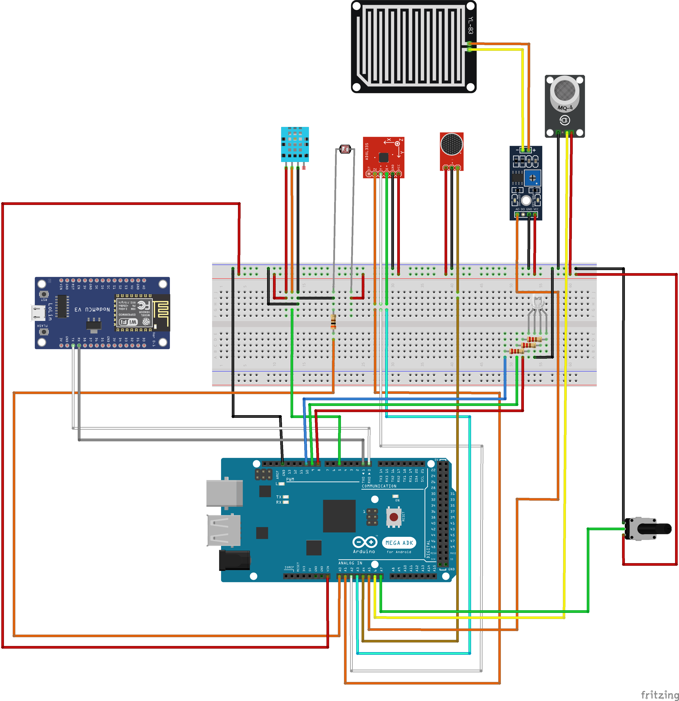

# IOTProject: DaWeather, estaciones meterológicas para ciudades inteligentes
Proyecto IOT 3 semestre

**Descripción:** Este proyecto opensource busca crear un sistema de estaciones meteorológicas decentralizadas que sean visualizadas en una web app

 # **Diagrama del circuito general de un nodo**

Este es el circuito general al cual se le pueden añadir mas sensores con el fin de obtener lecturas adicionales 




## **Extraccion de fingerprint googlemaps api para https requests GPS**

Descargar el certificado de www.googleapis.com como X.509 codificado base 64(.CER)

Tras descargar correr con Linux/MacOS/WSL el siguiente comando:
```bash
openssl x509 -noout -fingerprint -sha1 -inform pem -in certificate-file.cer > fingerprint.txt
```